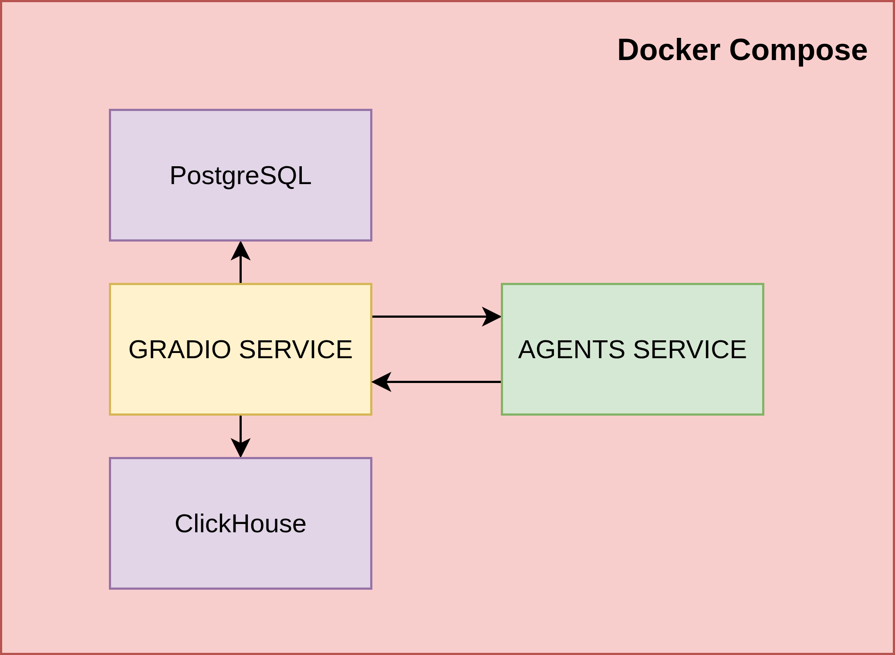
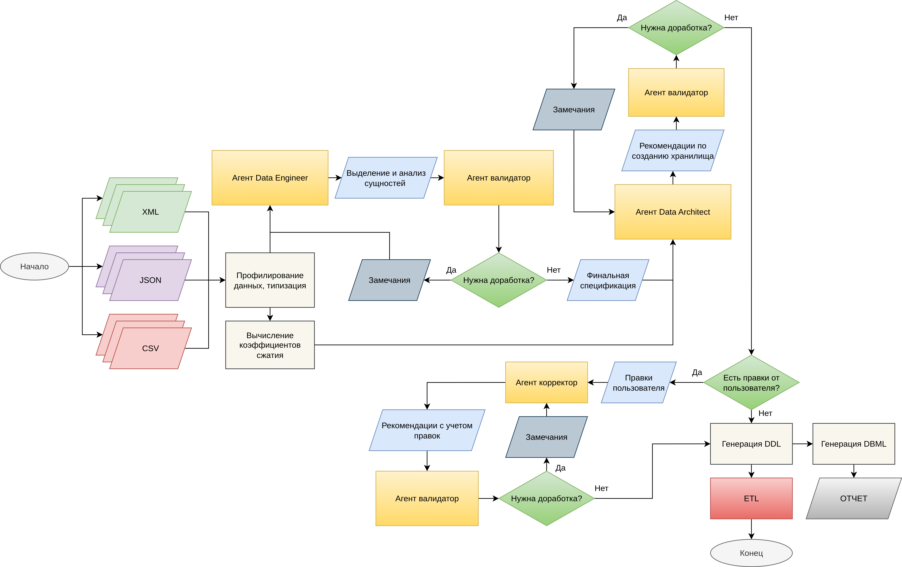

**Задача: 06 Интеллектуальный цифровой инженер данных**

**Команда JaJaBinx** 

# IDEA: Intelligent Data Engineering Assistant
Решение доступно по ссылке: `idea-msk.space`


## 🔍 Навигация
- [🚀 Инструкция по запуску](#Инструкция-по-запуску)
- [🎯 UserGuide](#UserGuide)
- [⚙️ Архитектура решения](#Архитектура-решения)
- [🧩 Примеры использования](#Примеры-использования)
- [📚 Презентация](#Презентация)


## Инструкция по запуску
```commandline
git clone https://github.com/moarseniy/idea.git
cd idea/
docker-compose up --build
```
Либо
```commandline
docker compose build && docker compose up
```

После этого можно обратиться к UI системы по https://localhost:7862

## UserGuide
В открывшемся UI можно выбрать нужно выбрать опцию: `**Создать новое хранилище**`

После чего откроется поле загрузки файлов CSV/JSON/XML.

Далее нужно указать реквизиты источника: имя пользователя, пароль и имя хранилища.

После нужно нажать на кнопку `**Загрузить данные, сделать аналитику**`.

Полученный результат в ходе генерации можно дополнять, после чего происходит запрос к системе на корректировку требований, и система корректирует требования в соответствии с запросом.

Система возвращает ответ в формате Markdown отчета в правом окне. 
Для скачивания полученного результата появляется кнопка `*Скачать результат*`.

В финале нужно нажать на кнопку `**Создать хранилище/загрузить данные**` для запуска ETL конвейера.

Посмотреть содержимое созданных хранилищ можно в правом верхнем углу. При перезапуске docker compose все хранилища должны быть доступны.

## Архитектура решения
Архитектура решения представлена в виде микросервисов.


Основная идея решения основана на LLM агентах, взаимодействующих между собой:


## Примеры использования (Скрин-касты)


## Презентация
src/JaJaBinx.pptx

